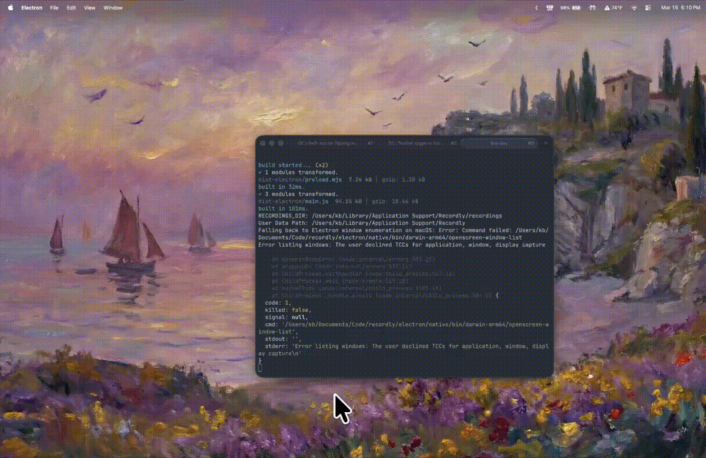

# Recordly

语言: [EN](README.md) | 简中

<p align="center">
  
</p>

<p align="center">
  
  
</p>

### 制作精致、专业级的屏幕录制视频。
[Recordly](https://www.recordly.dev) 是一款**开源录屏与编辑工具**，用于制作**精致的演示、讲解、教程和产品视频**。欢迎参与贡献。

Recordly 包含完整的光标动画与渲染管线、macOS 和 Windows 原生录屏系统、带动画的摄像头圆形叠加工作流、贴近 Screen Studio 的缩放动画、光标循环、音轨等更多核心功能。

<p align="center">
  
</p>

> [!NOTE]
> 非常感谢 **tadees** 的支持。这笔捐助会直接用于支付 Apple Developer 费用，帮助 Recordly 在 macOS 上完成签名和公证。目前仍在等待 Apple 审核。
[**支持项目**](https://ko-fi.com/webadderall/goal?g=0)


---
## Recordly 是什么？

Recordly 可以录制你的屏幕，并自动将内容整理为更精致的视频。它会自动放大关键操作、平滑抖动的光标移动，让你的演示默认就具备更专业的观感。

Recordly 运行于：

- **macOS** 12.3+
- **Windows** 10 Build 19041+
- **Linux**（现代发行版）

在 Windows 上，低于 19041 的版本会回退到 Electron 捕获，且无法隐藏光标。在 Linux 上，目前不支持隐藏光标（欢迎贡献）。


---

# 功能

### 光标动画
<p>
  
</p>

- 可调节光标大小
- 光标平滑
- 运动模糊
- 点击弹跳动画
- macOS 风格光标素材
- 光标摆动效果

### 录制

- 录制整个屏幕或单个窗口
- 录制后可直接进入编辑器
- 支持麦克风或系统音频录制
- Windows/Linux 使用 Chromium 捕获 API
- macOS 使用原生 **ScreenCaptureKit** 捕获
- Windows 使用原生 DXGI Desktop Duplication 录制辅助程序进行显示器和应用窗口捕获，并通过原生 WASAPI 处理系统/麦克风音频等

### 智能运动

- Apple 风格缩放动画
- 基于光标活动的自动缩放建议
- 手动缩放区域
- 缩放区域之间的平滑平移过渡

### 无限循环
<p>
  
</p>

- 可切换是否让光标在视频/GIF 结尾回到初始位置，从而生成更干净的循环效果

### 编辑工具

- 时间线裁剪
- 加速 / 减速区域
- 注释
- 缩放区段
- 项目保存与重新打开（`.recordly` 文件）

### 画面样式

- 壁纸
- 渐变
- 纯色填充
- 内边距
- 圆角
- 模糊
- 投影阴影

### 导出

- MP4 视频导出
- GIF 导出
- 画幅比例控制
- 质量设置

---

# 截图

<p align="center">
  
</p>

<p align="center">
  
</p>

---

# 安装

## 下载构建版本

预构建发布版见：

https://github.com/webadderall/Recordly/releases

---

## 从源码构建

```bash
git clone https://github.com/webadderall/Recordly.git recordly
cd recordly
npm install
npm run dev
```

---

## macOS: “无法打开应用”

Recordly 尚未签名。macOS 可能会隔离本地构建的应用。

使用以下命令移除隔离标记：

```bash
xattr -rd com.apple.quarantine /Applications/Recordly.app
```

---

# 系统要求

| 平台 | 最低版本 | 说明 |
|---|---|---|
| **macOS** | macOS 12.3 (Monterey) | ScreenCaptureKit 的最低要求。更旧版本无法正常进行录制和隐藏光标。 |
| **Windows** | Windows 10 20H1（Build 19041，2020 年 5 月） | 原生 DXGI Desktop Duplication 录制助手的最低要求。更旧版本会回退到 Electron 浏览器捕获，录制中会显示真实光标。 |
| **Linux** | 任意现代发行版 | 通过 Electron 捕获实现录制。录制中光标始终可见。系统音频需要 PipeWire（Ubuntu 22.04+、Fedora 34+）。 |

> [!IMPORTANT]
> 在 Windows 上，如果系统版本低于 19041，录制仍可使用，但**无法将光标从录制视频中隐藏**。

---

# 使用方法

## 录制

1. 启动 Recordly
2. 选择屏幕或窗口
3. 选择音频录制选项
4. 开始录制
5. 停止录制并打开编辑器

---

## 编辑

在编辑器中你可以：

- 手动添加缩放区域
- 使用自动缩放建议
- 调整光标行为
- 裁剪视频
- 添加变速
- 添加注释
- 调整画面样式

你可以随时将工作保存为 `.recordly` 项目。

---

## 导出

导出选项包括：

- **MP4**，适合完整质量的视频
- **GIF**，适合轻量分享

可调整：

- 画幅比例
- 输出分辨率
- 质量设置

---

# 限制

### 光标捕获（我们会在原始隐藏光标之上叠加第二个动画光标）

**macOS**：在 ScreenCaptureKit 层级就会将光标排除，因此始终干净。

**Windows**：光标排除依赖原生 DXGI Desktop Duplication 录制助手以及系统光标隐藏/恢复逻辑，需要 **Windows 10 Build 19041+**。在更旧版本中，应用会回退到 Electron 浏览器捕获，真实光标会出现在录制里。

**Linux**：Electron 的桌面捕获 API 不支持隐藏光标。真实系统光标将始终出现在录制中。如果你同时在编辑器中启用动画光标叠加，导出结果中可能会出现**两个光标**。

欢迎贡献，帮助改进跨平台光标捕获。

---

### 系统音频

系统音频捕获依赖平台支持。

**Windows**
- 开箱即用，使用原生 WASAPI
- 需要 Windows 10 Build 19041+

**Linux**
- 需要 PipeWire（Ubuntu 22.04+、Fedora 34+）
- 较旧的 PulseAudio 环境可能不支持系统音频

**macOS**
- 需要 macOS 12.3+
- 使用 ScreenCaptureKit 辅助程序

---

# 工作原理

Recordly 是一个**桌面视频编辑器**，以渲染驱动的运动管线和平台特定捕获层为核心。

**捕获**
- Electron 负责录制流程编排
- macOS 使用原生辅助程序处理 ScreenCaptureKit 和光标遥测
- Windows 使用原生 DXGI Desktop Duplication 进行屏幕捕获

**运动**
- 缩放区域
- 光标跟踪
- 变速
- 时间线编辑

**渲染**
- 场景合成由 **PixiJS** 处理

**导出**
- 帧通过同一套场景管线进行渲染
- 编码为 MP4 或 GIF

**项目**
- `.recordly` 文件保存源视频路径和编辑状态

---

# 贡献

欢迎所有贡献者参与。

特别需要帮助的方向：

- **Linux** 的平滑光标管线
- **摄像头** 叠加气泡
- **本地化** 支持，尤其是中文
- UI/UX **设计** 改进
- **导出速度** 改进

请注意：
- 保持 Pull Request **聚焦且模块化**
- 测试播放、编辑和导出流程
- 避免大型且无关的重构

详细指南请参阅 `CONTRIBUTING.md`。

---

# 社区

Bug 反馈和功能请求：

https://github.com/webadderall/Recordly/issues

欢迎提交 Pull Request。

---

# 捐助与赞助者

[捐助](https://ko-fi.com/webadderall/goal?g=0)

感谢所有支持者。你们在帮助 Recordly 保持开源，并支持持续开发。

• Tadees ($100)
• Anonymous supporter ($5)
• Anonymous supporter ($1)

其他事项可发送邮件至 youngchen3442@gmail.com，或通过 [@webadderall](https://x.com/webadderall) 私信联系。


---

# 许可证

Recordly 基于 **MIT License** 发布。

---

# 致谢

## 鸣谢

本项目最初构建于优秀的 [OpenScreen](https://github.com/siddharthvaddem/openscreen) 项目之上。

创建者  
[@webadderall](https://x.com/webadderall)

---
