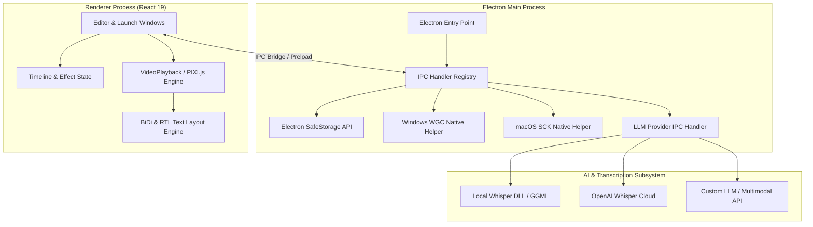

# Recordly System Architecture

**Current Version:** 1.4.0  
**Stack:** Electron + TypeScript + React 19 + Tailwind CSS + HeroUI + PIXI.js / Canvas 2D + Native C++ Helpers (WGC / SCK)

---

## 1. System Overview & Topology

Recordly is an open-source desktop screen recording and video motion editor. It couples low-overhead OS-level screen and audio capture with a high-performance timeline editor and multi-backend export pipeline.

---

## 2. Core Subsystems

### 2.1 Native Capture Layer
- **macOS:** Utilizes ScreenCaptureKit (`ScreenCaptureKitRecorder`) for hardware-accelerated screen, window, and microphone capture.
- **Windows:** Utilizes Windows Graphics Capture (`wgc-capture`) and WASAPI loopback audio recording.
- **Linux:** Falls back to Electron `desktopCapturer` APIs.

### 2.2 AI & Captioning Subsystem
- **Provider Abstraction:** Located in `electron/ipc/providers/` and configured via `src/lib/llmSettings.ts`.
- **Supported Modes:**
  1. `whisper-local`: Embedded GGML/Whisper runtime running offline.
  2. `openai-whisper`: Official OpenAI `/v1/audio/transcriptions` endpoint.
  3. `custom`: Custom LLM endpoints supporting both:
     - `chat-multimodal`: `/chat/completions` (e.g. Gemini 3.7 Flash, GPT-4o, Claude via proxy).
     - `audio-transcription`: Custom Whisper servers (Groq, faster-whisper, vLLM).
- **Security:** API keys and credentials are encrypted on disk using Electron's native `safeStorage` subsystem.

### 2.3 Bidirectional (BiDi) & RTL Text Engine
- **Module:** `src/lib/bidi.ts` and `src/components/video-editor/VideoPlayback.tsx`.
- **Text Flow:** Employs native inline bidirectional text flow (`Unicode BiDi` algorithm) supporting full Arabic/Hebrew script rendering, automatic word boundary preservation, and embedded LTR phrasing (e.g., code snippets, English terminology).
- **Export Parity:** Canvas 2D and WebGL renderers (`src/lib/exporter/modernFrameRenderer.ts`, `captionRenderer.ts`) synchronize coordinate offsets and text measurements with preview playback.

### 2.4 Rendering & Export Pipeline
- **Preview:** React + Canvas 2D / WebGL overlays with smooth spring-based camera tracking, auto-zoom suggestions, cursor sway, and squircle frame rendering.
- **Export:** Multi-backend architecture supporting Breeze native encoder, WebCodecs hardware encoding, and FFmpeg fallback pipelines.

---

## 3. Modernization & Long-term Architecture
For in-depth architectural modernization plans (including the Tauri/Rust core transition, cross-platform media pipelines, and unified design system), see:
- [docs/architecture/modernization/00-MASTER-ARCHITECTURE.md](architecture/modernization/00-MASTER-ARCHITECTURE.md)
